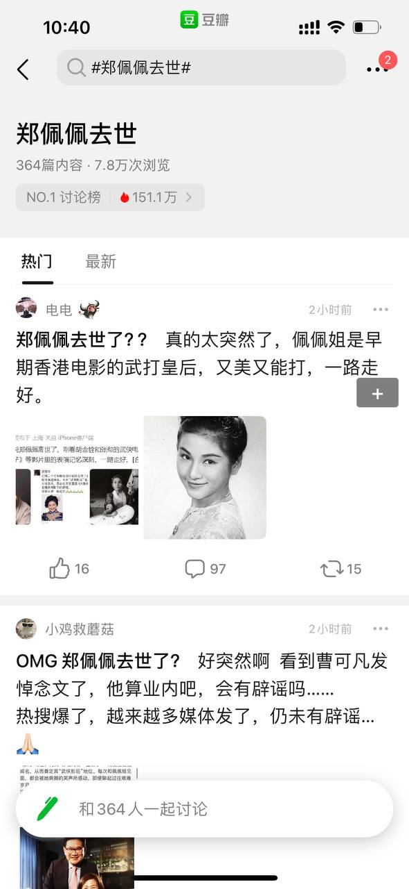
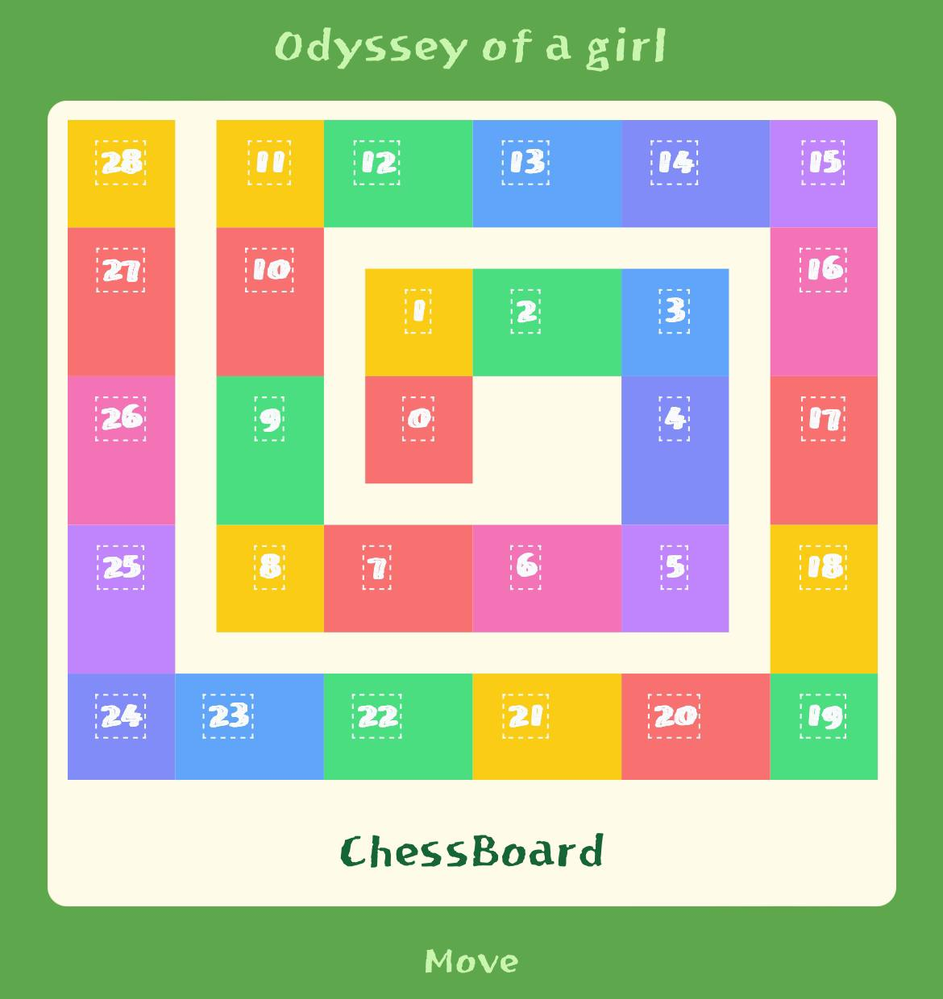
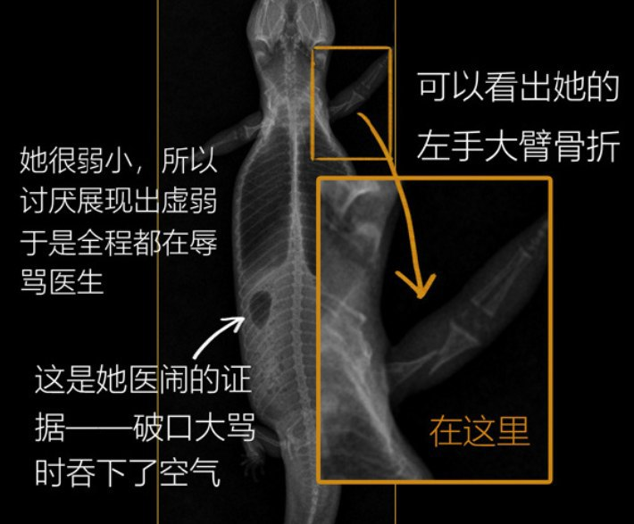
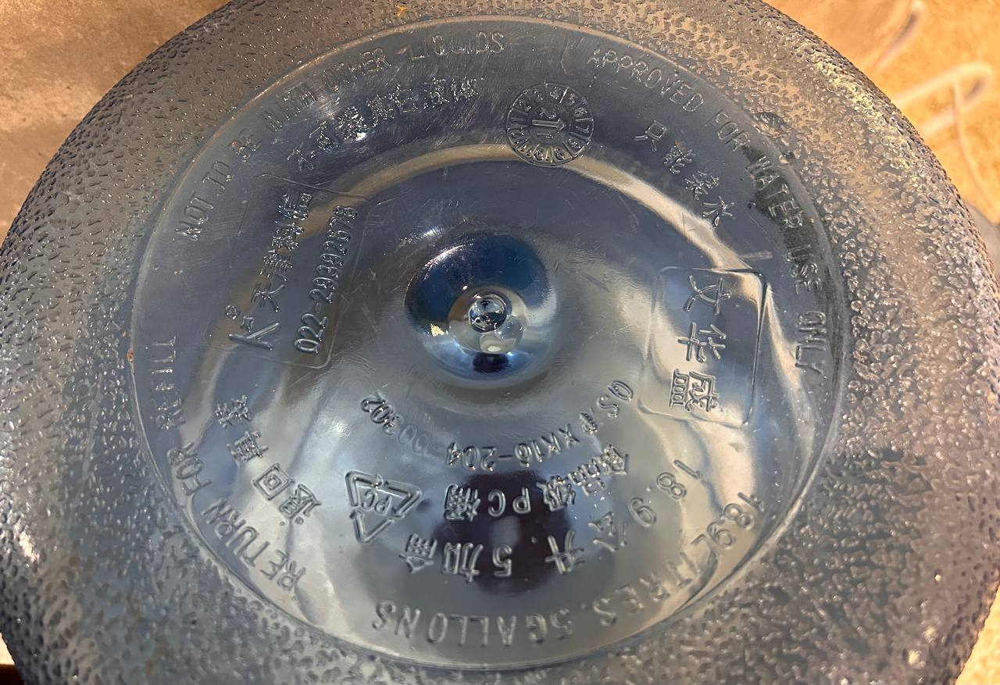
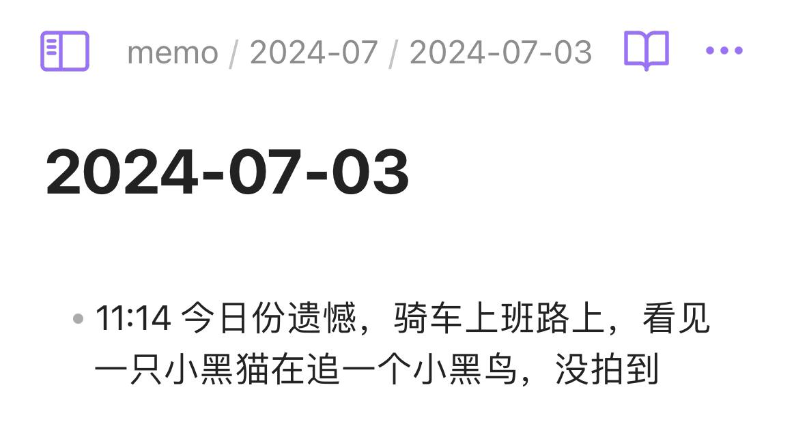
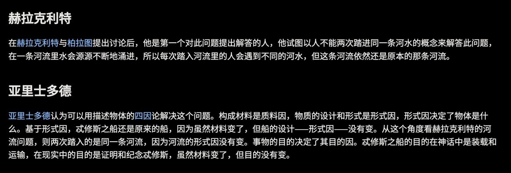

# 2024-07-19 02:42:20

哎，我看这季花少的时候，还是初三，已是十余年过去。

---
# 2024-07-19 05:27:48

可爱，虽然text居中又是一个问题，但是我不打算解决了。写核心功能去！

---
# 2024-07-19 09:21:26

https://weibo.com/2417007285/OnnyGlCqk

这个主人好可爱，讨厌展示出虚弱所以破口大骂的蜥蜴好可爱5555。

---
# 2024-07-19 09:26:37

突然注意到：不可装其他液体，只能装水。

---
# 2024-07-19 11:54:26

下午到某同事那里去晃悠聊天，得知她的一周日程会用三个 app 来落实： Agenda (想法) 到苹果日历（开发中） 再到 Obsidian （最终产物） ，我感受到了一丢丢的震撼。

我说上次被安利之后（也是去她那里晃悠后的结果），我的 Obsidian 都用来写如图这种小学生日记的，她：这些事情发一条豆瓣动态就好了啊。

这确实是两种不同的理念，于我而言，总结性的知识永远学不完记不完，要用到的时候去： 搜索引擎 / 论坛 / 聊天记录搜就好了，我不需要给这些东西专门分门别类还存个档。我要记的是当下那个时间点发生了什么我在想什么我感到怎么样，知识是客观的，可是主观的我再也不会有这一个相同的时刻了。

↑ 高中沉迷看萌芽（我都不好意思说爱格了）的伤感女孩如是说

---
# 2024-07-19 14:35:36

我对记录这类事情的态度就类似赫拉克利特：人不能两次踏进同一条河流 （（ 是这么用吗 2333333

---
# 2024-07-19 16:51:08

生命是有限的，要把有限的时间投入到回报价值高的事情上去。回报价值高的定义： 1. 对我自己好 2. 对别人好 3. 让我开心

为了实现这个目的，我要重启 Blog 记录的习惯，其实原来就不存在的话不应该说 “重启” 而是 “开始” 吧。争取两周一文章，内容有价值一些，避免意识流文章，避免插科打诨。

虽然我并不知道为什么这个因推出了这个果，这两件事好像也并没有必然联系吧。可能我就是想找点事情做。

- 严肃一些的 Eunice

