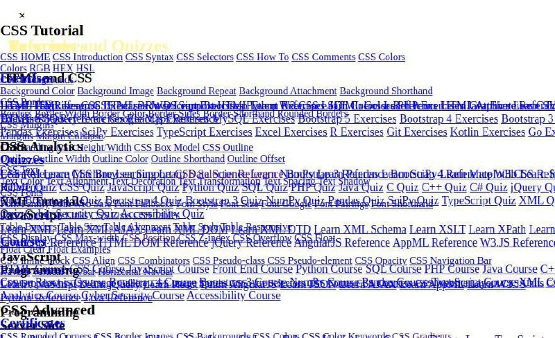
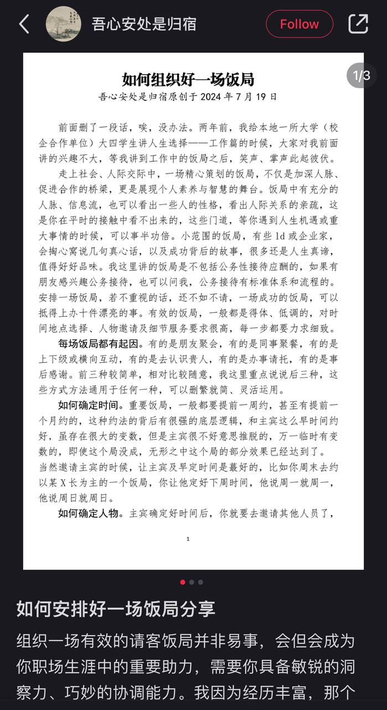
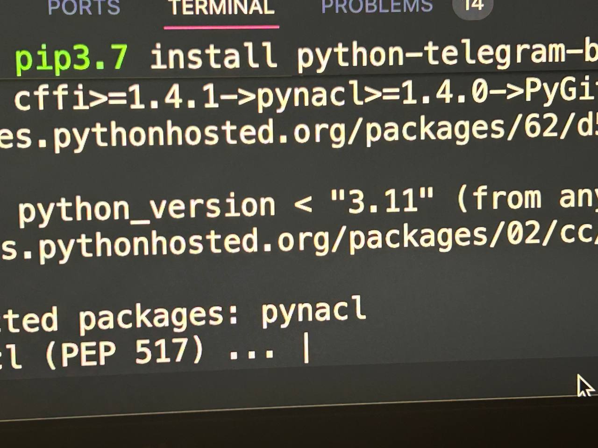
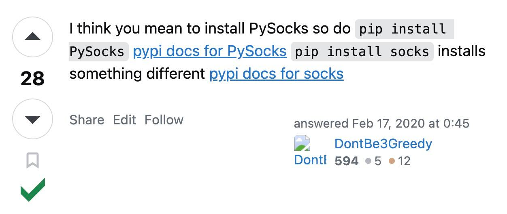
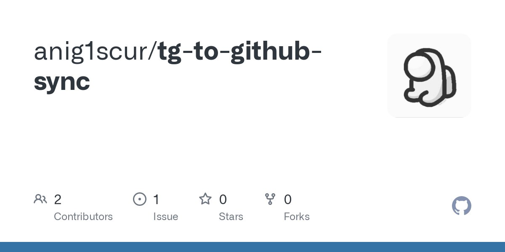

# 2024-07-20 07:03:12

看 shameless，发现 fuck 和 shit  是一组可以随意切换增加脏话多样性的词。 （这里面都不说 damn ，太“干净” 了）

---
# 2024-07-20 07:05:07

翻到一张旧图

#css #fun

---
# 2024-07-20 10:44:09

不大对劲，为什么我的小红书会给我推这个啊。

---
# 2024-07-20 12:38:25

为什么我在一亩三分地里都能看到这样的 “个签” .....

---
# 2024-07-20 13:06:58

在默克尔纪录片的评论区看到这句话，我浑身起了鸡皮疙瘩

---
# 2024-07-20 14:23:13

从未思索过的视角.. 最近开始上 threads 比较多，发现这个算是一个短文字输入比较好的来源。另外，Web 和 app 设计均佳，交互很美妙，这个对我很重要。

---
# 2024-07-20 15:26:38

Py 氯化钠，勾起一些本科期间给密码“加盐”的记忆。

---
# 2024-07-20 17:44:30

python 这是什么劣习 （使用与实际不一致） 见到不止一个了

---
# 2024-07-20 20:39:15

弄了一个 tg channel 到 github 同步的玩儿意: https://github.com/anig1scur/tg-to-github-sync 。但现在这个 ifttt ：https://ifttt.com/applets/Ed3eDvEU-if-new-post-in-channel-capricious_eunice-eunice-in-caprice-then-create-a-comment 后半部分还不工作，所以不能算是自动化。

---
# 2024-07-20 21:43:24

昨天下午迷迷糊糊睡了两个多小时，快到八点的时候跑出去买了一大杯冰美式喝。导致我到这个点才躺在床上。其实我还是不困，只是觉得应该睡觉了。

忘了说，ifttt 可真是开放互联网的典范啊精华啊！国内应用为什么完全不见这种互联。（豆瓣标记有一个同步到微博和空间但那已经是 long long ago 的事情了）

